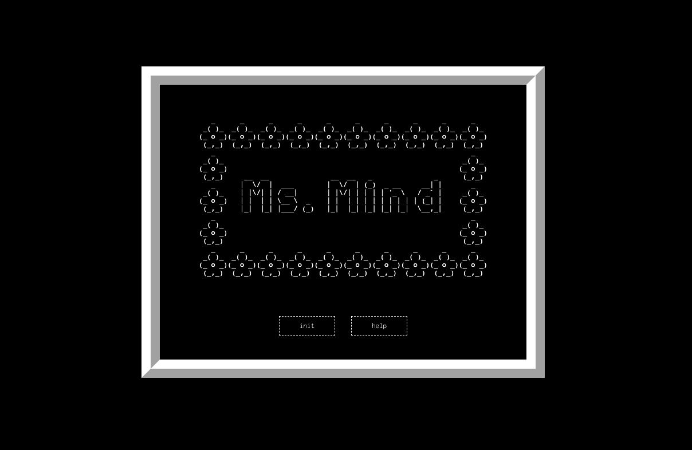
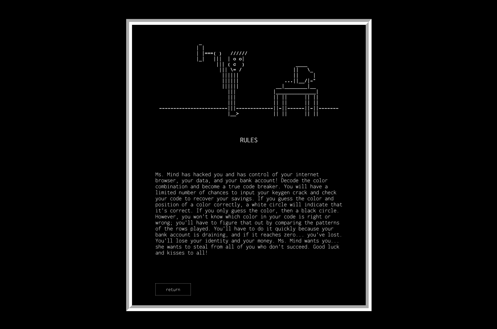
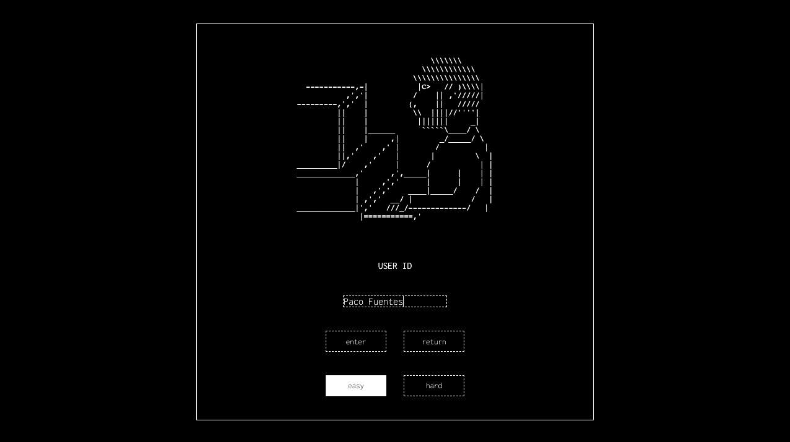
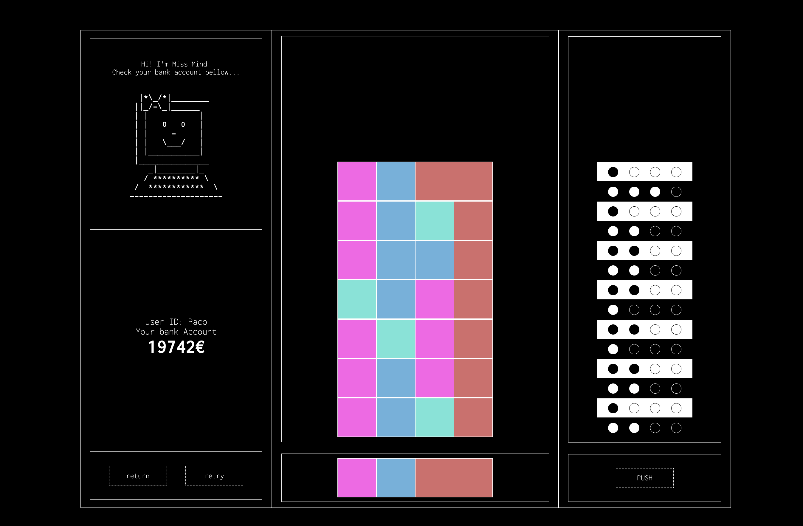
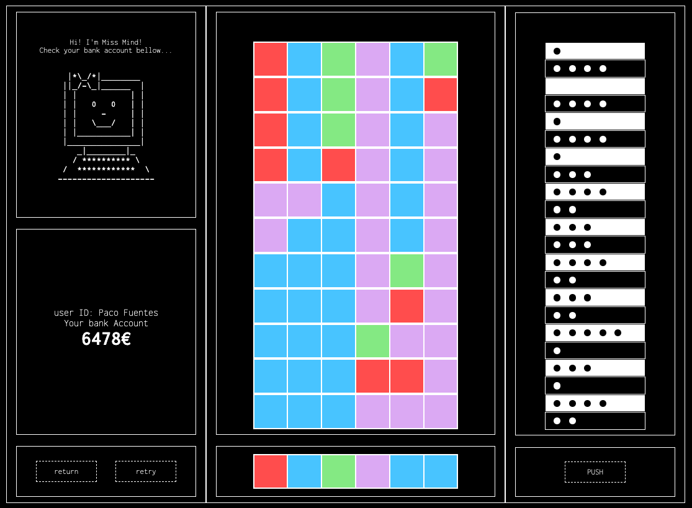
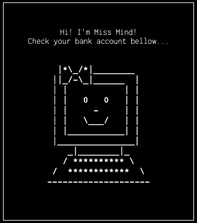
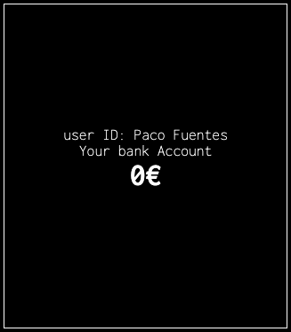

# Ms. Mind

#### by Paco Fuentes

---

Classic Mastermind Board Game Implementation.

This project is a version of the classic Mastermind board game, where a player must decode a pattern proposed by another player using black and white checks to get an approximate idea of what is correct and what is not. It serves as the third project completed during the GeeksHubs Academy Fullstack Bootcamp and marks the first project with a reasonable use of JavaScript.

#### Deploy on Github Pages

Link => [Mastermind](https://paco-fuentes.github.io/btc-geekshubs-30092023-proyecto-3/).

---

## Table of contents
* [💻 Tech](#tech)
* [:eyeglasses: Manual](#manual)
* [:video_game: Walkthrough](#walkthrough)
* [:pick: Development](#development)
* [💡 Observations](#observations)
* [📃 License](#license)

---

## Tech:

Used tech stacks:

---

## Manual:

  Ms. Mind has hacked you and has control of your internet browser, your data, and your bank account!

  Decode the color combination and become a true code breaker.
  
  You will have a limited number of chances to input your keygen crack and check your code to recover your savings.
  
  If you guess the color and position of a cell correctly, a white circle will indicate that it's correct. If you only guess the color, then a black circle. However, you won't know which color in your code is exactly right or wrong; you'll have to figure that out by comparing the patterns of the rows you played before.
  
  You'll have to do it quickly because your bank account is draining, and if it reaches zero... you've lost. You'll lose your identity and your money.
  
  Ms. Mind wants you... she wants to steal from all of you who don't succeed.
  
  Good luck and kisses to all!

---

## Walkthrough

---
1. Home Screen:
The home screen displays the game title and two buttons: "Init" to start the game and "Help" that takes you to the help screen.

2. Help Pages:
Help pages provide context to the player and explain the rules of the game. This is crucial for players to understand how to play.

3. User Page:
On this page, the player must enter a user ID of up to 10 characters. If this requirement is not met, the continue button is inactive. Difficulty can also be optionally selected (default is easy), and there's a return button to go back to the home page.

4. Game Page:
The game screen shows the game interface to the player. The game begins and has a time limit. Ms. Mind's color combination is displayed based on the selected difficulty.

Easy Mode:

Hard Mode:

5. "You Win" Display:
If the player guesses the color combination of each cell, the amount of money saved from their bank account is shown, along with Ms. Mind's winning combination.

6. "Game Over" Display:
This screen appears when the player has exhausted the number of chances to decode the palette or when the money reaches zero. It shows Ms. Mind's winning combination.

---

## Development:

### This is the way

#### Game strategy and winner algorithm

To tackle this project, the game system was first defined, outlining the conditions for winning or losing a game and the player's strategy during gameplay. Specifically, the design focused on the validation system for each played row, which serves as the core algorithm and draws inspiration from the classic board game "MASTERMIND."

In each cell of every row, the player can achieve success in two ways:

Correct Color: If the guessed color is present in Ms. Mind's combination, it is indicated with a black circle.

Correct Color and Position: If both the color and position of the guessed cell match Ms. Mind's combination, a white circle is displayed.

The number of correct guesses (both black and white circles) is provided, and these correct guesses may not necessarily be in the same position as in the winning combination. If none are correct, no circles are displayed. If all are correct, the player wins the game.

This design mirrors the classic "MASTERMIND" gameplay mechanics, adding an engaging and strategic element to the user experience. 

#### Step by step design

Firstly, I sketched a paper outline showing the different pages with their content, order, and relationships.

On the user page, I learned to access DOM elements from JavaScript and the basic usage of the browser's local storage to save a user. The color picker page introduced additional complexity as it required saving an array from the inputs to local storage as a string.

Upon reaching the game page, I first retrieved data from local storage of the previous pages and displayed them on the screen. I also prepared the layout to begin testing the "row checker" function, which is the core engine of the game.

In a separate document named rowChecker.js, I constructed the JavaScript algorithm within a function, passing various arrays for testing purposes.

Once I had a functional version, I brought the rowChecker.js algorithm into my project to "connect" it to the rest of JavaScript and the DOM. The testing process looked like this:

After several tests and programming corrections, I had a consistent game.

Then came the final design with CSS, imitating the "console" style of a computer from roughly the '90s. I also searched for ASCII content, originally planning to draw it myself but eventually running out of time. Fortunately, and for the better, I found high-quality drawings on the website https://www.asciiart.eu/. I also designed the game logo by converting text to ASCII.

Once completed, I added a hard mode to the game, which was not difficult because the content of the game board is dynamically drawn in code.

To add a personal touch, I decided to include a countdown timer in the game to give it a more arcade-style feel.

---

---

---

## Observations:

#### Known Bugs at Project Delivery

1. fixed: Color Palette Button Issue:

~~Problem: The color palette buttons occasionally require multiple clicks.
Observation: There appears to be a correlation with the array position in the previous row and the number of clicks relative to the current row.~~

2. fixed: Empty Username Field Bypass:

~~Problem: Entering a name and subsequently deleting it allows entry with an empty username field.
Observation: Deleting the entered name should trigger validation to prevent submission with an empty username.~~

<pre style="text-align: center">
                            
                                               |     |
                                               \\_V_//
                                               \/=|=\/
                                                [=v=]
                                              __\___/_____
                                             /..[  _____  ]
                                            /_  [ [  M /] ]
                                           /../.[ [ M /@] ]
                                          <-->[_[ [M /@/] ]
                                         /../ [.[ [ /@/ ] ]
                    _________________]\ /__/  [_[ [/@/ C] ]
                   <_________________>>0---]  [=\ \@/ C / /
                      ___      ___   ]/000o   /__\ \ C / /
                         \    /              /....\ \_/ /
                      ....\||/....           [___/=\___/
                     .    .  .    .          [...] [...]
                    .      ..      .         [___/ \___]
                    .    0 .. 0    .         <---> <--->
                 /\/\.    .  .    ./\/\      [..]   [..]
                / / / .../|  |\... \ \ \    _[__]   [__]_
               / / /       \/       \ \ \  [____>   <____]

</pre>

### Achivements and Solutions

- #### First Project with JavaScript:

I've gained insights into variable scopes, function handling, and loops through loops, in my initial project with JavaScript. Understanding how to manage these aspects is crucial for effective programming.

- #### Initial Experience with DOM Manipulation:

This project marks my first foray into manipulating the Document Object Model (DOM). I've learned how to dynamically write and remove HTML elements directly from JavaScript code. Additionally, exploring the usage of local storage enhances my understanding of data persistence.

- #### Introduction to Game Design:

This project has served as an introduction to game design principles. I've learned how to structure a small program and design a user interface (UI) for an optimal user experience (UX). This encompasses considerations for how users interact with the application and the visual aspects that make it engaging.

### Enhancements

#### The following proposals are still pending:

- Clue System: In the original board game, the player acting as the code master gives clues to the player trying to guess the color combination, the code breaker. The box with Ms. Mind's illustration has been designed so that in a future version 2.0, the clue system will be active and provide hints to the player. For example, it could indicate if a color is repeated or part of the combination in time-critical situations or when there is only one chance left.
- Responsive Design.
- Light Mode toggle.
- Sounds on buttons.
- Background music.
- Small animations between two or three different ASCII drawings.

---

## License

<pre style="text-align: center">
                  
                            (\ 
                            \'\ 
                             \'\     __________  
                             / '|   ()_________)
                             \ '/    \ ~~~~~~~~ \
                               \       \ ~~~~~~   \
                               ==).      \__________\
                              (__)       ()__________)
                  
  </pre>

  Este proyecto está bajo la Licencia MIT. Consulta el archivo [LICENSE](./LICENSE) para obtener más detalles.

---

## Autor
Paco Fuentes

<pre style="text-align: center">       

..--""|
       |     |
       | .---'
         (\-.--| |-----------.
        / \) \ | |            \
        |:.  | | |             |
        |:.  | |o| E - M A I L |    ----- >   pacofuentes.work@gmail.com
        |:.  | `"`             |
        |:.  |_  __   __ _  __ /
        `""""`""""|=`|"""""""`
                  |=_|
                  |= |

</pre>