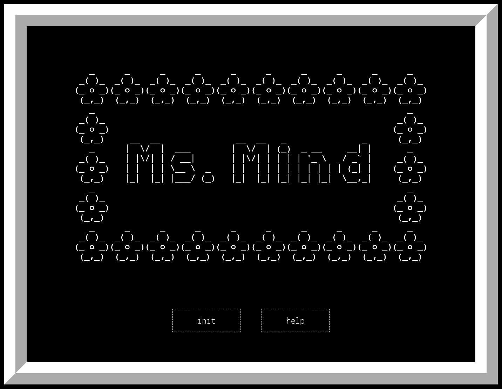
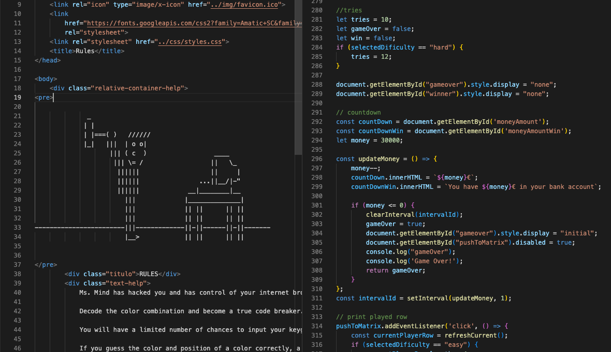
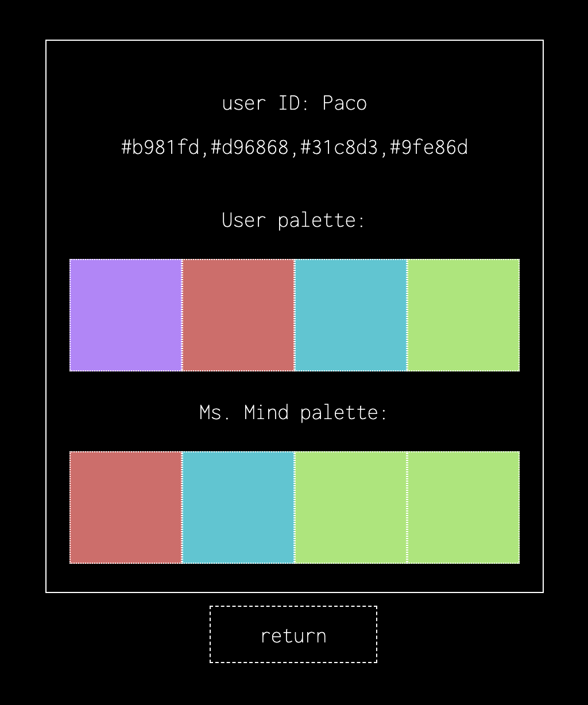
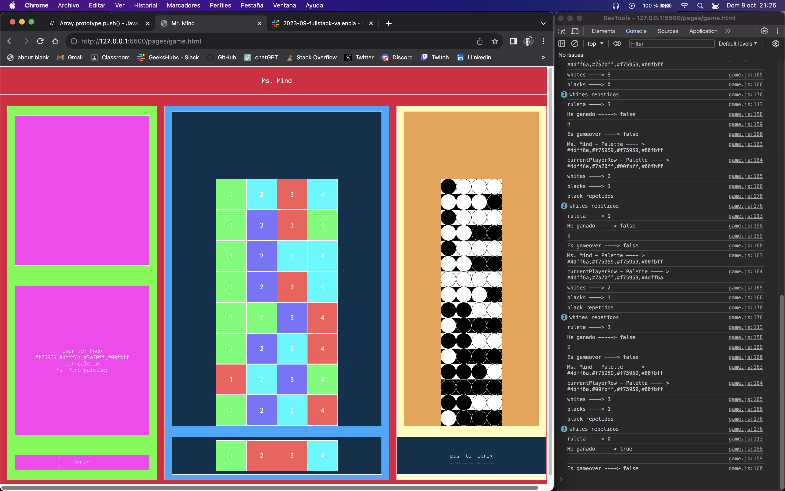
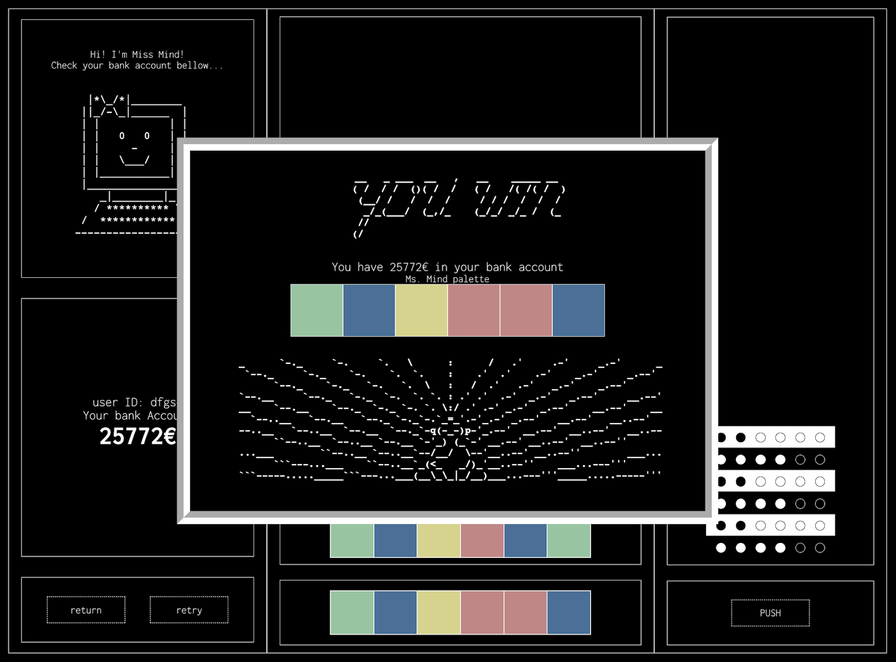

# Ms. Mind

---

Classic Mastermind Board Game Implementation.

This project is a version of the classic Mastermind board game, where a player must decode a pattern proposed by another player using black and white checks to get an approximate idea of what is correct and what is not. It serves as the third project completed during the GeeksHubs Academy Fullstack Bootcamp and marks the first project with a reasonable use of JavaScript.

#### Desploy on Github Pages

Link => [Mastermind](https://paco-fuentes.github.io/btc-geekshubs-30092023-proyecto-3/).

---

## Table of contents
* [💻 Tech](#tech)
* [:pick: Development](#development)
* [🕹️ Manual](#manual)
* [💡 Observations](#observations)
* [📃 License](#license)

---

### Tech:

---

## Development:

---

---

---

---
    

## Manual:

  Ms. Mind has hacked you and has control of your internet browser, your data, and your bank account!

  Decode the color combination and become a true code breaker.
  
  You will have a limited number of chances to input your keygen crack and check your code to recover your savings.
  
  If you guess the color and position of a cell correctly, a white circle will indicate that it's correct. If you only guess the color, then a black circle. However, you won't know which color in your code is right or wrong; you'll have to figure that out by comparing the patterns of the rows you played before.
  
  You'll have to do it quickly because your bank account is draining, and if it reaches zero... you've lost. You'll lose your identity and your money.
  
  Ms. Mind wants you... she wants to steal from all of you who don't succeed.
  
  Good luck and kisses to all!

---

## Observations:

### Known Bugs at Project Delivery

<pre style="text-align: center">
                            
                                                        |     |
                                                        \\_V_//
                                                        \/=|=\/
                                                         [=v=]
                                                       __\___/_____
                                                      /..[  _____  ]
                                                     /_  [ [  M /] ]
                                                    /../.[ [ M /@] ]
                                                   <-->[_[ [M /@/] ]
                                                  /../ [.[ [ /@/ ] ]
                             _________________]\ /__/  [_[ [/@/ C] ]
                            <_________________>>0---]  [=\ \@/ C / /
                               ___      ___   ]/000o   /__\ \ C / /
                                  \    /              /....\ \_/ /
                               ....\||/....           [___/=\___/
                              .    .  .    .          [...] [...]
                             .      ..      .         [___/ \___]
                             .    0 .. 0    .         <---> <--->
                          /\/\.    .  .    ./\/\      [..]   [..]
                         / / / .../|  |\... \ \ \    _[__]   [__]_
                        / / /       \/       \ \ \  [____>   <____]

</pre>

1. Color Palette Button Issue:

Problem: The color palette buttons occasionally require multiple clicks.
Observation: There appears to be a correlation with the array position in the previous row and the number of clicks relative to the current row.

2. Empty Username Field Bypass:

Problem: Entering a name and subsequently deleting it allows entry with an empty username field.
Observation: Deleting the entered name should trigger validation to prevent submission with an empty username.

These observations are crucial for enhancing the project's quality and user experience.

### Logros y soluciones:

- 

### Enhancements

The following proposals are still pending:

- Clue System: In the original board game, the player acting as the code master gives clues to the player trying to guess the color combination, the code breaker. The box with Ms. Mind's illustration has been designed so that in a future version 2.0, the clue system will be active and provide hints to the player. For example, it could indicate if a color is repeated or part of the combination in time-critical situations or when there is only one chance left.
- Inactive Button Styles need to be implemented.
- Sounds on buttons.
- Background music.
- Small animations between two or three different ASCII drawings.

---

---

### License

Este proyecto está bajo la Licencia MIT. Consulta el archivo [LICENSE](./LICENSE) para obtener más detalles.

<pre style="text-align: center">
                  
                  (\ 
                  \'\ 
                   \'\     __________  
                   / '|   ()_________)
                   \ '/    \ ~~~~~~~~ \
                     \       \ ~~~~~~   \
                     ==).      \__________\
                    (__)       ()__________)
                  
  </pre>

---

### Autor
Paco Fuentes

<pre style="text-align: center">       

..--""|
       |     |
       | .---'
         (\-.--| |-----------.
        / \) \ | |            \
        |:.  | | |             |
                             |:.  | |o| E - M A I L |    ----- > pacofuentes.work@gmail.com
        |:.  | `"`             |
        |:.  |_  __   __ _  __ /
        `""""`""""|=`|"""""""`
                  |=_|
                  |= |

</pre>