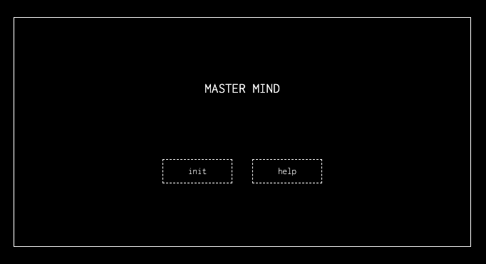

# Mastermind

---

Juego mastermind

#### Despliegue en Github Pages

Link => [Mastermind]().

---

## Tabla de contenidos
* [💻 Tecnologías utilizadas](#tecnologías-utilizadas)
* [:pick: Desarrollo](#desarrollo)
* [🕹️ Manual](#manual)
* [💡 Observaciones](#observaciones)
* [📃 Licencia](#licencia)

---

### Tecnologías utilizadas:

---

## Desarrollo:

---

---

---

---
    

## Manual:

---

## Observaciones:

### Bugs Conocidos a la entrega del proyecto

1. 

### Logros y soluciones:

- 

### Mejoras 

Quedan pendientes las siguientes propuestas:

- 

---

---

### Licencia

Este proyecto está bajo la Licencia MIT. Consulta el archivo [LICENSE](./LICENSE) para obtener más detalles.

---

### Autor
Paco Fuentes